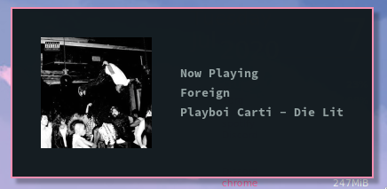
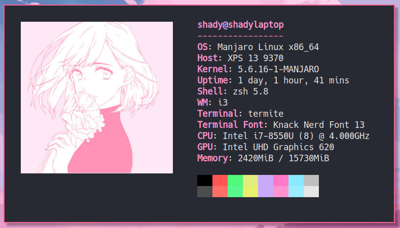

# Sorbet

Dotfiles for my current i3 rice

---
### Setup
* **WM**: i3
* **OS**: Manjaro i3
* **Terminal**: Termite
    * color scheme: [dracula](https://github.com/adi1090x/termite-style), slightly tweaked
    * font: Knack Nerd Font 13 (use [termite-style](https://github.com/adi1090x/termite-style))
* **Bar**: Polybar
    * theme: [this](https://github.com/adi1090x/polybar-themes), tweaked (find in this repo).
    * fonts: 
        * Source Code Pro Extra Bold
        * Siji (for glyphs, find it under `.config/polybar/fonts`)
* **Notification daemon**: dunst
* **dmenu**: rofi
* **Spotify**: spicetify 
    * theme: [dribbblish](https://github.com/morpheusthewhite/spicetify-themes/tree/master/Dribbblish) (tweaked, find mine in this repo)
* **desktop widget**: conky
    * tweaked version of default config included with Manjaro i3

--- 

### More screenshots

